# L1L2_control

## Topology



## Run

Host

```shell
% docker run --rm -it -v $PWD:/cue/app -w /cue/app shinch13/cue:0.4.3 cue export config/networks*.yaml config/commands*.yaml --out yaml > net.yaml
% sudo nsnet create 
```

node2

```shell
% sudo nsnet shell node2
root@89bc12d113ef:/# iperf3 -s
```

node1

```shell
% sudo nsnet shell node1
root@72e79b74ae44:/# ping 10.0.0.2
root@72e79b74ae44:/# ping 20.0.0.2
root@72e79b74ae44:/# ping 30.0.0.2

root@89bc12d113ef:/# sudo tc qdisc show
root@72e79b74ae44:/# iperf3 -c 10.0.0.2
root@72e79b74ae44:/# iperf3 -c 20.0.0.2
root@72e79b74ae44:/# iperf3 -c 30.0.0.2
```

## Bondind

Bondingは複数のネットワークインターフェースを束ねて冗長化したり、帯域を増やす方式。  
Linuxではmodeを選択してBondingの論理インターフェースを作成する。  
ここではよく使う3つのモードを記載。

### mode

active-backup
* 1つの物理インターフェースでのみ応答
* 受信はActiveポートからのみARP応答することで誘導
* example

```shell
% ip link add bond0 type bond miimon 100 mode active-backup primary eth2 primary_reselect always
```

balance-xor
* Static LAG
* 送信元/宛先情報を元に負荷分散
* 負荷分散に使う情報はパラメータであるxmit_hash_policyによって設定可能
* 受信は全ての物理インタフェースで可能
* example

```shell
% ip link add bond0 type bond miimon 100 mode balance-xor xmit_hash_policy layer2+3
```

802.3ad
* Dynamic LAG (LACP方式)
* 送信元/宛先情報を元に負荷分散
* 負荷分散に使う情報はパラメータであるxmit_hash_policyによって設定可能
* 受信は LACP でネゴの取れたインタフェースのみから可能
* example

```shell
% ip link add bond0 type bond miimon 100 mode 802.3ad lacp_rate fast xmit_hash_policy layer2+3
```

### parameters

* miimon ${time_in_milliseconds}
  * MIIはNICがアクティブであることを検証するために使用される
  * `100`がスタート、短いほど高可用性になるが負荷見合いで設定する
* primary ${interface_name}
  * `mode: active-backup`で使用するパラメータ
  * プライマリーデバイスのインターフェース名を指定する
* primary_reselect　${always, better, failuer}
  * `mode: active-backup`で使用するパラメータ
  * アクティブポートに障害が発生したり、プライマリーポートの復旧が発生したときに再選択ポリシーを指定する
  * `always`の場合、常にprimaryで設定したインタフェースを選択する
* xmit_hash_policy ${layer2, layer2+3, layer3+4}
  * `mode: balance-xor`および`mode: 802.3ad`で使用するパラメータ
  * ポート選択に使用する送信ハッシュポリシーを選択
  * `layer2+3`の場合、layer2およびlayer3プロトコル情報の組み合わせを使用してハッシュを生成します
* lacp_rate ${slow, fast}
  * `mode: 802.3ad`で使用するパラメータ
  * `slow`の場合、パートナーが30秒ごとにLACPDUを送信するよう指定します。
  * `fast`の場合、パートナーが1秒ごとにLACPDUを送信するよう指定します。

### example

設定

```shell
% ip link add bond0 type bond miimon 100 mode 802.3ad lacp_rate fast xmit_hash_policy layer2+3
% ip link set dev eth0 down
% ip link set dev eth1 down
% ip link set dev bond0 down
% ip link set dev eth0 master bond0
% ip link set dev eth1 master bond0
% ip link set dev eth0 up
% ip link set dev eth1 up
% ip link set dev bond0 up
```

削除

```shell
% ip link del bond0 type bond
```

確認コマンド

```shell
% ip a
% dmesg | egrep 'bond0|NIC|miimon'
% cat /proc/net/bonding/bond0
```

### Links
* <https://www.kernel.org/doc/Documentation/networking/bonding.txt>
* <https://access.redhat.com/documentation/ja-jp/red_hat_enterprise_linux/7/html/networking_guide/sec-using_channel_bonding>
* <http://www.uni-koeln.de/~pbogusze/posts/LACP_configuration_using_iproute2.html>
* <https://milestone-of-se.nesuke.com/nw-basic/link-aggregation/linux-bonding-and-switch-config/>

## tc(traffic control)

tc(traffic control)コマンドのトークンバケットフィルタ(TBF: token bucket filter)を利用している。  
トークンバケットフィルタは下記の方式でアウトバウンドの帯域を制限する。

TBFでは指定されたレートを超えないようにパケットを通すqdisc方式。  
バケツ(burst)とトークンによる流量制御を行う。バケツには設定した速度(rate)でトークンが溜まっていく。  

パケットが到着した際はパケットと同じサイズのトークンをバケツから消すことで、パケットが通過できるようになる。  
バケツにトークンがない状態でパケットが届いた際は、  
トークンが溜まるまで指定したサイズのキュー(limit)に溜まるか、指定時間待機するか(latency)設定できる

* burst(バケツサイズ)
  * バケツサイズはrateで指定した値 / HZ 以上である必要がある
  * HZはカーネルパラメータ。`cat /boot/config-$(uname -r) | grep CONFIG_HZ`で確認できる値

* latency(最大待機時間)
  * バケツが空の時に到着したパケットが最大待機時間を経過するとパケットは破棄される

* limit(最大サイズ)
  * バケツが空の時に到着したパケットがキュー(limit)に溜まり最大サイズを超えるとパケットは破棄される

### example

設定

```shell
% cat /boot/config-`uname -r` | grep 'CONFIG_HZ='
CONFIG_HZ=250
% tc qdisc add dev eth0 root tbf rate 20mbit burst 80kb limit 800kb
```

削除

```shell
% tc qdisc del dev eth0 root
```

確認コマンド

```shell
% ifconfig
% sudo tc qdisc show dev eth0
```

### Links

* <https://dev.classmethod.jp/articles/shaping_outbound_traffic_from_linux/>
* <https://cha-shu00.hatenablog.com/entry/2020/02/10/131836#tbftoken-bucket-filter>
* <https://blog.bitmeister.jp/?p=3930>
* <https://www.infraexpert.com/study/qos20.htm>