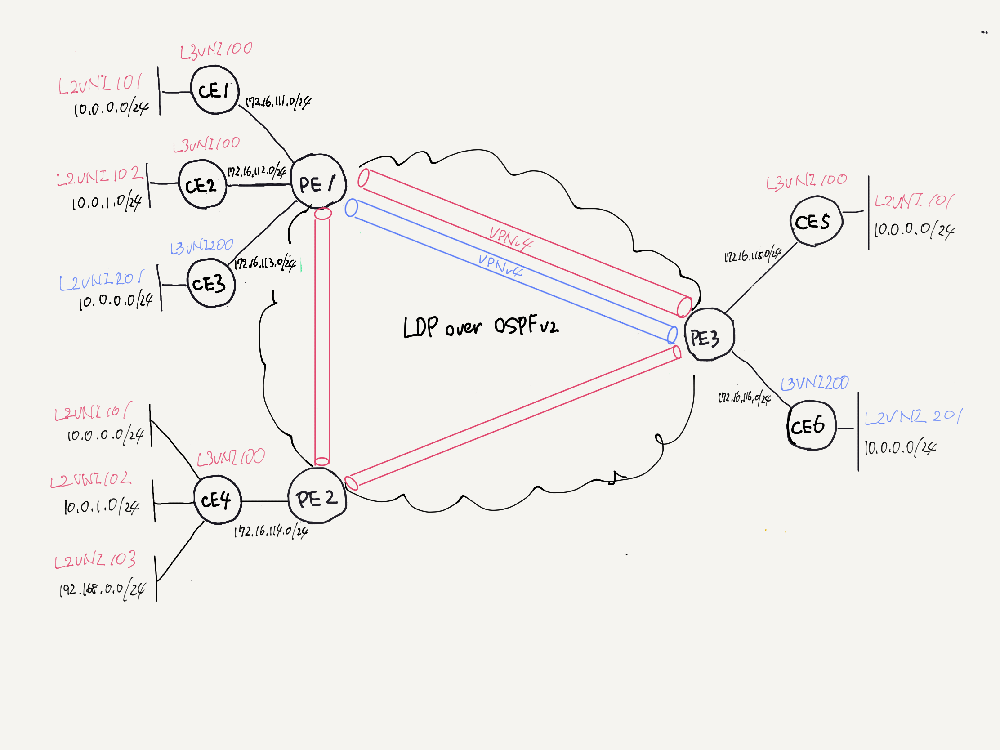
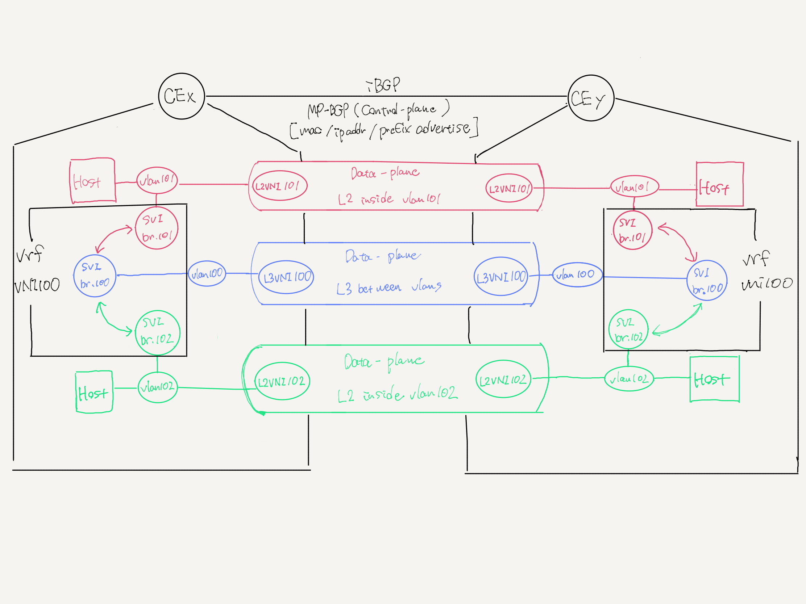

# EVPN

## Topology





## Host Requirement

```shell
% sudo apt install linux-modules-extra-`uname -r` 
% sudo modprobe mpls_router mpls_iptunnel mpls_gso
% lsmod | grep mpls 
```

## Run

Nsnet command

```shell
% docker run --rm -it -v $PWD:/cue/app -w /cue/app shinch13/cue:0.4.3 cue export config/networks*.yaml config/commands*.yaml --out yaml > net.yaml
% sudo nsnet create 
```

Advertise EVPN Type2 Forcibly

```shell
% docker-compose exec ce1 ip netns exec h1 ping -c2 10.0.0.1 \
    && docker-compose exec ce2 ip netns exec h2 ping -c2 10.0.1.1 \
    && docker-compose exec ce3 ip netns exec h3 ping -c2 10.0.0.1 \
    && docker-compose exec ce4 ip netns exec h4-1 ping -c2 10.0.0.1 \
    && docker-compose exec ce4 ip netns exec h4-2 ping -c2 10.0.1.1 \
    && docker-compose exec ce4 ip netns exec h4-3 ping -c2 192.168.0.1 \
    && docker-compose exec ce5 ip netns exec h5 ping -c2 10.0.0.1 \
    && docker-compose exec ce6 ip netns exec h6 ping -c2 10.0.0.1
```

L2VNI Test

```shell
% sudo nsnet shell ce1 && ip netns exec h1 ping -c2 10.0.0.15
% sudo nsnet shell ce3 && ip netns exec h3 ping -c2 10.0.0.16
```

L3VNI Test

```shell
% sudo nsnet shell ce1 && ip netns exec h1 ping -c2 10.0.1.14
% sudo nsnet shell ce1 && ip netns exec h1 ping -c2 192.168.0.14
```

### Check Command

```shell
#-----------------------------------------
# common
#-----------------------------------------
tcpdump -i any port 4789       # VXLAN のパケット監視
tcpdump -i any port 179        # BGP/EVPN のパケット監視

#-----------------------------------------
# L2
#-----------------------------------------
bridge fdb show                # bridge の Forwarding DB の確認
bridge link                    # bridge 配下のIF一覧
bridge monitor link            # bridge のイベント監視
bridge monitor fdb
ip neighbor                    # ARPテーブル確認
ip neighbor show dev br.101    # IF 
ip -s neigh flush all          # ARPテーブル初期化
ip -d link show type vxlan     # vrf-1 に属するIFの詳細情報

#-----------------------------------------
# L3
#-----------------------------------------
ip route show vrf VPN-A-1      # ルーティングテーブルの確認
ip -d addr show vrf VPN-A-1    # vrf-1 に属するIFの詳細情報
ip -d addr show type vxlan     # VXLAN IF の詳細情報

#-----------------------------------------
# FRR
#-----------------------------------------
show running-config            # FRR の設定
show ip route                  # ルーティングテーブルの確認
show ip route vrf VPN-A-1      # ルーティングテーブル(vrf)の確認
show bgp summary               # BGP 情報
show bgp vrf VPN-A-1 summary   # Overlay BGP の情報
show bgp l2vpn evpn summary    # EVPN の状態確認
show bgp l2vpn evpn vni        # VNIとVRFの情報
show bgp l2vpn evpn vni 100    # VNIとVRFの情報
show bgp l2vpn evpn vni 101    # VNIとVRFの情報
show evpn vni                  # VNIの情報
show evpn vni 100              # VNIの情報
show evpn vni 101              # VNIの情報
```

## Links

* <https://qiita.com/tom7/items/1bc7f4e568b20c306845#frr-vtep-2-%E3%81%AE%E8%A8%AD%E5%AE%9A>
* <https://qiita.com/tom7/items/472e9871128ef082d1f1>
* <https://legacy.netdevconf.info/2.2/slides/prabhu-linuxbridge-tutorial.pdf>
* <https://www.denog.de/media/DENOG10/day2_1100_EVPN-to-the-host.pdf>
* <https://nwktimes.blogspot.com/2018/04/vxlan-part-vi-vxlan-bgp-evpn-basic.html>
