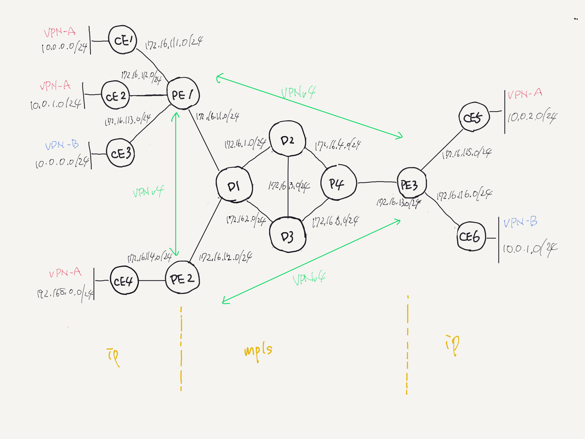
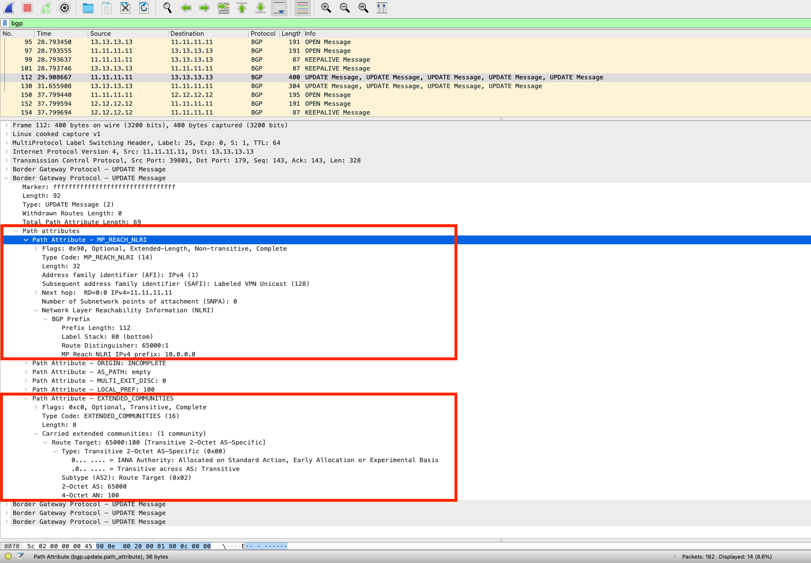

# mpls_l3vpn

## Topology



## Host Requirement

```shell
% sudo apt install linux-modules-extra-`uname -r` 
% sudo modprobe mpls_router mpls_iptunnel mpls_gso
% lsmode | grep mpls 
```

## Run

ce1

```shell
ping -I 10.0.0.1 10.0.2.1
ping -I 10.0.0.1 192.168.0.1
```

ce3

```shell
ping -I 10.0.0.1 10.0.1.1
```

pe1

```shell
root@3744a3c9a74e:/# tcpdump -i any -n -l | grep ICMP 
tcpdump: verbose output suppressed, use -v or -vv for full protocol decode
listening on any, link-type LINUX_SLL (Linux cooked), capture size 262144 bytes

17:30:39.876183 IP 10.0.0.1 > 10.0.2.1: ICMP echo request, id 254, seq 1, length 64
17:30:39.876192 MPLS (label 25, exp 0, ttl 63) (label 80, exp 0, [S], ttl 63) IP 10.0.0.1 > 10.0.2.1: ICMP echo request, id 254, seq 1, length 64
17:30:39.876263 MPLS (label 80, exp 0, [S], ttl 63) IP 10.0.2.1 > 10.0.0.1: ICMP echo reply, id 254, seq 1, length 64
17:30:39.876264 IP 10.0.2.1 > 10.0.0.1: ICMP echo reply, id 254, seq 1, length 64
17:30:39.876265 IP 10.0.2.1 > 10.0.0.1: ICMP echo reply, id 254, seq 1, length 64
17:30:42.561498 IP 10.0.0.1 > 192.168.0.1: ICMP echo request, id 255, seq 1, length 64
17:30:42.561508 MPLS (label 24, exp 0, ttl 63) (label 80, exp 0, [S], ttl 63) IP 10.0.0.1 > 192.168.0.1: ICMP echo request, id 255, seq 1, length 64
17:30:42.561526 MPLS (label 80, exp 0, [S], ttl 63) IP 192.168.0.1 > 10.0.0.1: ICMP echo reply, id 255, seq 1, length 64
17:30:42.561526 IP 192.168.0.1 > 10.0.0.1: ICMP echo reply, id 255, seq 1, length 64
17:30:42.561565 IP 192.168.0.1 > 10.0.0.1: ICMP echo reply, id 255, seq 1, length 64
17:30:42.964101 IP 10.0.0.1 > 10.0.2.1: ICMP echo request, id 254, seq 4, length 64
17:30:42.964112 MPLS (label 25, exp 0, ttl 63) (label 80, exp 0, [S], ttl 63) IP 10.0.0.1 > 10.0.2.1: ICMP echo request, id 254, seq 4, length 64
17:30:42.964176 MPLS (label 80, exp 0, [S], ttl 63) IP 10.0.2.1 > 10.0.0.1: ICMP echo reply, id 254, seq 4, length 64
17:30:42.964177 IP 10.0.2.1 > 10.0.0.1: ICMP echo reply, id 254, seq 4, length 64
17:30:42.964178 IP 10.0.2.1 > 10.0.0.1: ICMP echo reply, id 254, seq 4, length 64
```

## BGP UPDATE Message


