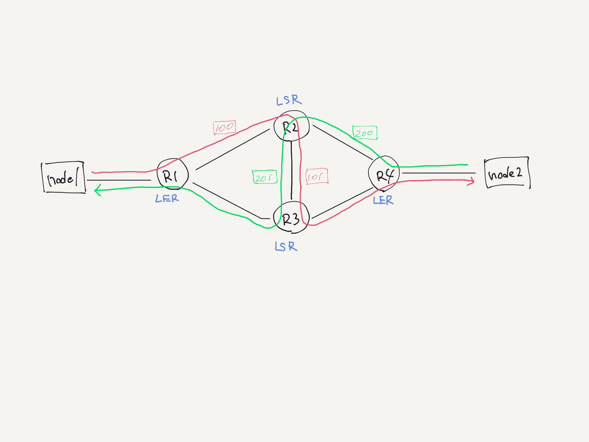

# simple_mpls_ldp

## Topology



## Host Requirement

```shell
% sudo apt install linux-modules-extra-`uname -r` 
% sudo modprobe mpls_router mpls_iptunnel mpls_gso
% lsmod | grep mpls 
```

## Run

Nsnet command

```shell
% docker run --rm -it -v $PWD:/cue/app -w /cue/app shinch13/cue:0.4.3 cue export config/networks*.yaml config/commands*.yaml --out yaml > net.yaml
% sudo nsnet create 
```

Node1

```shell
% sudo nsnet shell node1
root@11850533c17b:/# ping 10.1.2.40
```

Node2

```shell
% sudo nsnet shell node2
root@23c81ac41c4f:/# tcpdump -i any -n -l | grep ICMP
tcpdump: verbose output suppressed, use -v or -vv for full protocol decode
listening on any, link-type LINUX_SLL (Linux cooked), capture size 262144 bytes

14:51:21.034402 IP 10.1.1.10 > 10.1.2.40: ICMP echo request, id 12, seq 1, length 64
14:51:21.034426 IP 10.1.2.40 > 10.1.1.10: ICMP echo reply, id 12, seq 1, length 64
```

Router1

```shell
% sudo nsnet shell router1
root@a0add3a23d9d:/# tcpdump -i any -n -l | grep ICMP
tcpdump: verbose output suppressed, use -v or -vv for full protocol decode
listening on any, link-type LINUX_SLL (Linux cooked), capture size 262144 bytes

14:53:13.933489 IP 10.1.1.10 > 10.1.2.40: ICMP echo request, id 28, seq 20, length 64
14:53:13.933498 MPLS (label 100, exp 0, [S], ttl 63) IP 10.1.1.10 > 10.1.2.40: ICMP echo request, id 28, seq 20, length 64
14:53:13.933518 IP 10.1.2.40 > 10.1.1.10: ICMP echo reply, id 28, seq 20, length 64
14:53:13.933520 IP 10.1.2.40 > 10.1.1.10: ICMP echo reply, id 28, seq 20, length 64
```

Router2

```shell
% sudo nsnet shell router2
root@ade01f24ff69:/# tcpdump -i any -n -l | grep ICMP
tcpdump: verbose output suppressed, use -v or -vv for full protocol decode
listening on any, link-type LINUX_SLL (Linux cooked), capture size 262144 bytes

14:56:06.193168 MPLS (label 100, exp 0, [S], ttl 63) IP 10.1.1.10 > 10.1.2.40: ICMP echo request, id 28, seq 187, length 64
14:56:06.193172 MPLS (label 101, exp 0, [S], ttl 62) IP 10.1.1.10 > 10.1.2.40: ICMP echo request, id 28, seq 187, length 64
14:56:06.193192 MPLS (label 200, exp 0, [S], ttl 63) IP 10.1.2.40 > 10.1.1.10: ICMP echo reply, id 28, seq 187, length 64
14:56:06.193193 MPLS (label 201, exp 0, [S], ttl 62) IP 10.1.2.40 > 10.1.1.10: ICMP echo reply, id 28, seq 187, length 64
```

Router3

```shell
% sudo nsnet shell router3
root@fc9b58435c5b:/# tcpdump -i any -n -l | grep ICMP
tcpdump: verbose output suppressed, use -v or -vv for full protocol decode
listening on any, link-type LINUX_SLL (Linux cooked), capture size 262144 bytes

14:57:00.807545 MPLS (label 101, exp 0, [S], ttl 62) IP 10.1.1.10 > 10.1.2.40: ICMP echo request, id 28, seq 240, length 64
14:57:00.807548 IP 10.1.1.10 > 10.1.2.40: ICMP echo request, id 28, seq 240, length 64
14:57:00.807562 MPLS (label 201, exp 0, [S], ttl 62) IP 10.1.2.40 > 10.1.1.10: ICMP echo reply, id 28, seq 240, length 64
14:57:00.807563 IP 10.1.2.40 > 10.1.1.10: ICMP echo reply, id 28, seq 240, length 64
```

Router4

```shell
% sudo nsnet shell router4
root@a0d343477e4a:/# tcpdump -i any -n -l | grep ICMP
tcpdump: verbose output suppressed, use -v or -vv for full protocol decode
listening on any, link-type LINUX_SLL (Linux cooked), capture size 262144 bytes

14:57:42.789992 IP 10.1.1.10 > 10.1.2.40: ICMP echo request, id 28, seq 281, length 64
14:57:42.789996 IP 10.1.1.10 > 10.1.2.40: ICMP echo request, id 28, seq 281, length 64
14:57:42.790017 IP 10.1.2.40 > 10.1.1.10: ICMP echo reply, id 28, seq 281, length 64
14:57:42.790020 MPLS (label 200, exp 0, [S], ttl 63) IP 10.1.2.40 > 10.1.1.10: ICMP echo reply, id 28, seq 281, length 64
```
